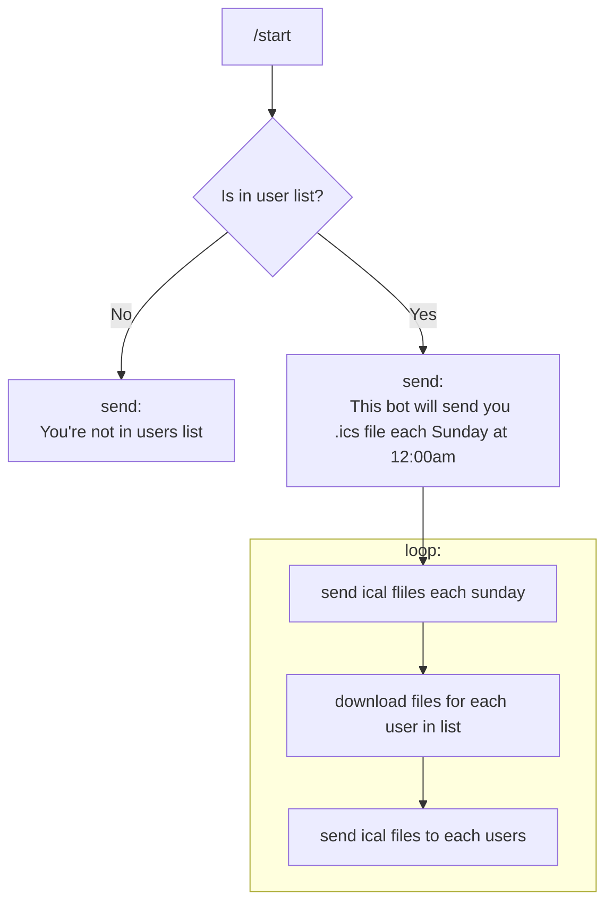

# Modeus calendar telegram-bot

This bot has list of names to whom it sends .isc files on specific datetime.

flow chart for this bot:

To configure it set env vars `USERNAME` and `PASSWORD` to appropriate values.
Set `users.csv` file with telegram usernames.